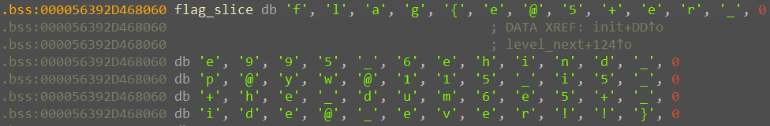

# game

CTF: CSAW'CTF 22  
Category: rev  

# Description

---

> I found this game and it has a Patreon page. There are some easter eggs hidden behind a paywall. Can you get the easter eggs for me without paying for them?
> 
> 
> `nc rev.chal.csaw.io 5003`
> 

[](https://ctf.csaw.io/challenges#game-110)

We are given a 64-bit ELF for x86-64, dynamically linked, not stripped, called *game*.

When we launch it:

> You have encountered a cave system. You need to get to the other side but you don't have enough resources to retrace your steps. Can you make it to the other side?

0
Which cave would you like to take:
        The left cave (1)
        The center cave (2)
        The right cave (3)
Choice:
> 

We are prompted for a direction.

Notice that this is a remote service.

# Solution

---

 The `main()` function calls `init()`, initializes `case_id` to 0 and calls `level_gen()`.

## `init()` function

This function opens two files, *flag.txt* and *map.csv.*

`init()` copies the contents of *flag.txt* in variable `flag_slice` splitting it in 5 chunks of equal length (soon it’ll be pretty clear the flag stored in *flag.txt* is 60 characters long).



*map.csv* is used to initialize the global variable `states[45]` used in `level_next()`.

## `level_gen()` function

This function lets us choose in which direction to go, then calls `level_next()` where the main logic is implemented.

## `level_next()` function

Reversing the first few lines we understand that the global variable `states` mentioned earlier is the map of the caves and `case_id` is the current position on the map.

The position is updated after the choice in `level_gen()` this way:

```c
case_id = states[ (choice-1) + 3 * case_id ];
```

After the update there are 4 possibilities:

1. valid position
    1. When `case_id in range(15)`
    2. Execution goes back to `level_gen()` to make another move
2. winning position
    1. When `case_id == 15`
    2. Prints “You have reached the exit! You win! Did you find all the easter eggs? You can go back and play the game to find all 5 of them”, then stops execution
3. paywall position
    1. When `case_id in range(100, 105)`
    2. To continue a password is required
4. dead-end position
    1. `else`
    2. Execution is stopped

## Paywall

When we hit a paywall position the program calculates an hash using the algorithm *fnv1a32* with 4 different words depending on the value of `case_id`.

This hash is the password required to continue.

Recalling that we don’t have the map since it is a remote service, we shouldn’t be able to know the value of `case_id` when we end up in a paywall position.

The program basically tells us the position if we get the password wrong printing a string with an hint:

```c
__printf_chk(1LL, "You have entered the wrong password! You can obtain the right password by paying us USD$%.2f to our Patreon page\n", v9);
```

Where `v9` is $10^{case\_id - 100}\times 0.01$, this way we have an equation to know the `case_id` of a certain paywall position.

In short:

```python
$0.01   -> case_id = 100 -> fnv_1a_32("cook")     -> 67430062848092457
$0.10   -> case_id = 101 -> fnv_1a_32("flawed")   -> 39002813882185094
$1.00   -> case_id = 102 -> fnv_1a_32("gravel")   -> 40648526973039866
$10.00  -> case_id = 103 -> fnv_1a_32("king")     -> 33487301024932822
$100.00 -> case_id = 104 -> fnv_1a_32("decisive") -> 20420080099521315
```

If we insert the right password we are given a slice of the flag (one of the chunks in `flag_slice`) so we have to get to every paywall position, that’s not an easy thing to do without *map.csv*.

## Reversing *map.csv*

To obtain *map.csv* we have to bruteforce every possible move. I used a dictionary with `case_id` as key and a list with the three positions that we obtain moving left, center and right, as value. Then I bruteforced it with a recursive approach.

```python
{'0': ['1', '2', '3'],
'1': ['Patreon', 'Dead', '4'],
'2': ['4', '5', '5'],
'3': ['Dead', '6', '6'],
'4': ['7', 'Dead', 'Dead'],
'5': ['Dead', 'Patreon', 'Patreon'],
'6': ['Dead', 'Dead', 'Dead'],
'7': ['8', '9', 'Patreon'],
'8': ['10', '10', 'Dead'], 
'9': ['Dead', '11', '11'], 
'10': ['Dead', 'Dead', 'Patreon'], 
'11': ['Patreon', '12', '13'], 
'12': ['Patreon', 'Patreon', '14'], 
'13': ['14', 'Dead', 'Dead'], 
'14': ['7', '15', '0'], 
'15': ['None', 'None', 'None'], 
'16': ['None', 'None', 'None'], 
'17': ['None', 'None', 'None'], 
'18': ['None', 'None', 'None'], 
'19': ['None', 'None', 'None'], 
'20': ['None', 'None', 'None'], 
'21': ['None', 'None', 'None'], 
'22': ['None', 'None', 'None'], 
'23': ['None', 'None', 'None'], 
'24': ['None', 'None', 'None'], 
'25': ['None', 'None', 'None'], 
'26': ['None', 'None', 'None'], 
'27': ['None', 'None', 'None'], 
'28': ['None', 'None', 'None'], 
'29': ['None', 'None', 'None'], 
'30': ['None', 'None', 'None'], 
'31': ['None', 'None', 'None'], 
'32': ['None', 'None', 'None'], 
'33': ['None', 'None', 'None'], 
'34': ['None', 'None', 'None'], 
'35': ['None', 'None', 'None'], 
'36': ['None', 'None', 'None'], 
'37': ['None', 'None', 'None'], 
'38': ['None', 'None', 'None'], 
'39': ['None', 'None', 'None'], 
'40': ['None', 'None', 'None'], 
'41': ['None', 'None', 'None'], 
'42': ['None', 'None', 'None'], 
'43': ['None', 'None', 'None'], 
'44': ['None', 'None', 'None']}
```

(of course there’s no reason to have available moves with a `case_id` bigger than 14 since it would stop the program beforehand)

Example:

```python
case_id = 1 -> choice = 1 -> Patreon (paywall position)
            -> choice = 2 -> Dead    (dead-end position)
            -> choice = 3 -> 4       (new case_id)
```

I thought it would have been handy to rebuild the entire *map.csv* in local to further debug the program. At the end it actually wasn’t necessary but here it is the equivalent version I rebuilt:

```python
1, 2, 3, 100, 88, 4, 4, 5, 5, 88, 6, 6, 7, 88, 88, 88, 101, 101, 88, 88, 88, 8, 9, 102, 10, 10, 88, 88, 11, 11, 88, 88, 103, 103, 12, 13, 104, 104, 14, 14, 88, 88, 7, 15, 0
```

With this dictionary we can calculate every path to a paywall position. Also we can get to know which paywall position it is with the hint explained before.

These are some possible paths to get to every paywall position:

```python
Paywall_0: case_id = 100 -> moves = [1, 1]
Paywall_1: case_id = 101 -> moves = [2, 2, 2]
Paywall_2: case_id = 102 -> moves = [1, 3, 1, 3]
Paywall_3: case_id = 103 -> moves = [1, 3, 1, 2, 2, 1]
Paywall_4: case_id = 104 -> moves = [1, 3, 1, 2, 3, 2, 2]
```

Finally we get every slice of the flag:

```python
Paywall_0: "flag{e@5+er_"
Paywall_1: "e995_6ehind_"
Paywall_2: "p@yw@115_i5_"
Paywall_3: "+he_dum6e5+_"
Paywall_4: "ide@_ever!!}"
```

`flag = "flag{e@5+er_e995_6ehind_p@yw@115_i5_+he_dum6e5+_ide@_ever!!}"`
